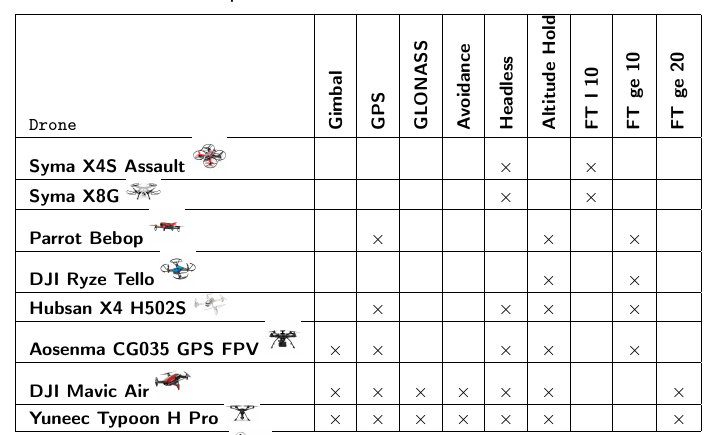
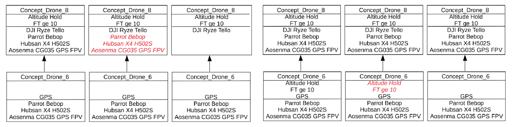
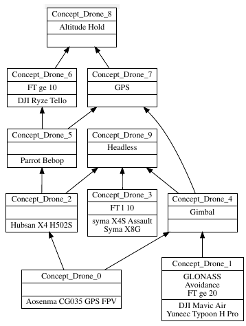
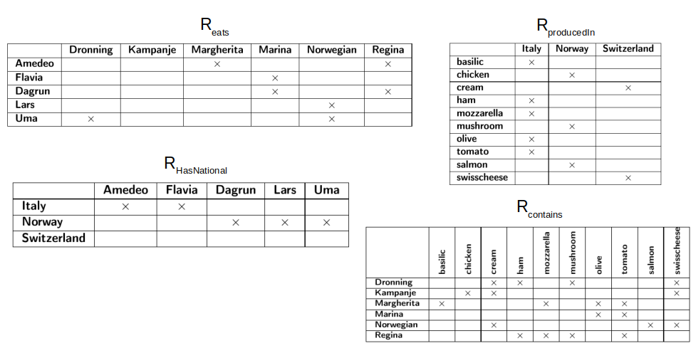
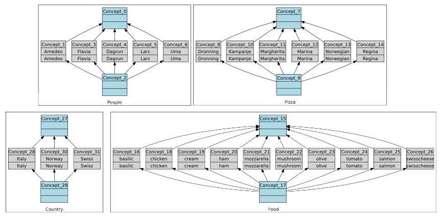
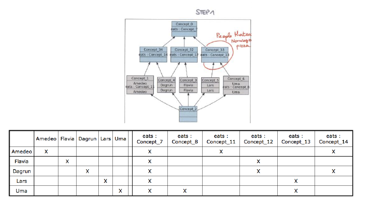
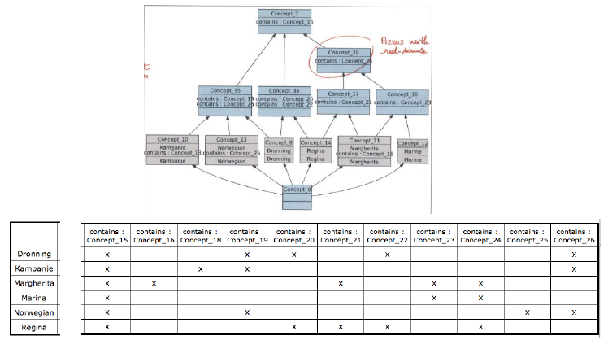
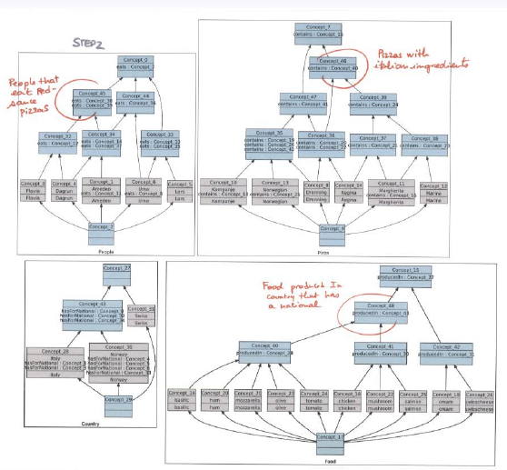
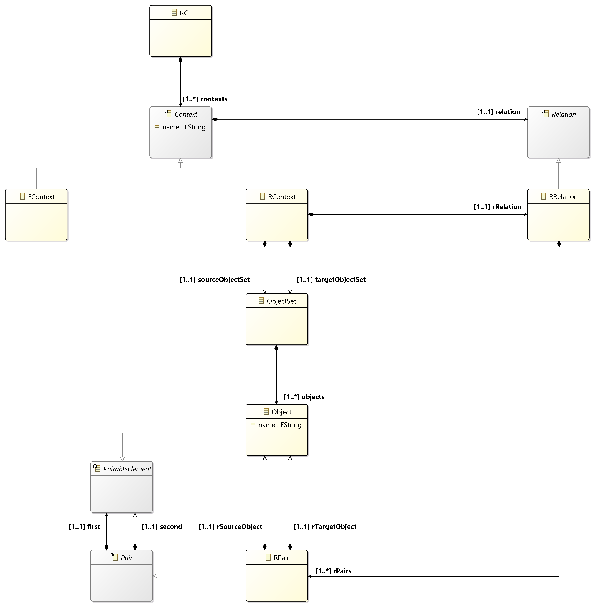
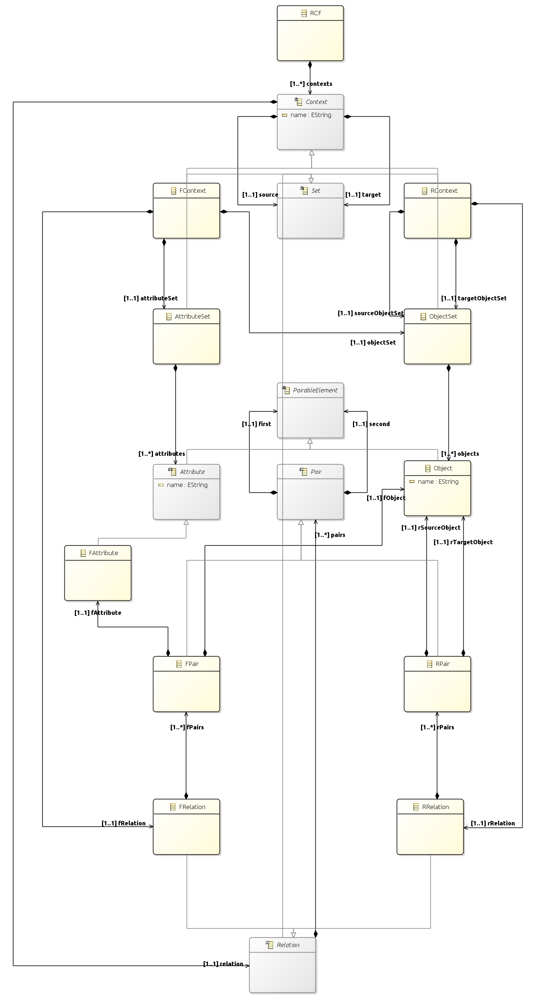

# Introduction
This project defines an RCA metamodel, as it was mainly conceived during the UML2RCA use-case of metamodel transformations (https://github.com/anonbnr/UML2RCA).

## FCA (Formal Context Analysis)
### Introduction
**FCA** is a data analysis and classification method used in many domains of computer sciences (*e.g. knowledge representation, knowledge engineering, information retrieval, supervised/unsupervised machine learning,* $\dots$), based on the mathematical theories of order and lattices. It is mainly used to formally represent the notions of formal contexts and formal concepts.

### Formal contexts
A **formal context** $K$ is a triplet $(O, A, I)$, where $O$ is a **set of objects**, $A$ is a **set of boolean formal attributes**, and $I \subseteq O \times A$ is a **binary incidence relation**, such that every couple $(o, a)$ belonging to $I$ indicates that the object $o$ has the attribute $a$.

### Formal concepts
Given a formal context $K = (O, A, I)$, a **formal concept** $C$ of $K$ is a couple $(E, I)$, where $E \subseteq O$ is called the **extension** of the concept, and $I \subseteq A$ is called the **intension** of the concept. More specifically, $C$ represents a maximum set of objects sharing a maximum set of attributes. Moreover, the set of all formal concepts associated to $K$ is denoted by $C_K$.

### Subsumption relation
Given a formal context $K = (O, A, I)$, **FCA** defines a **subsumption relation**, designating a **partial order relation**, denoted by $\leq_S$, over the set of all the formal concepts associated to it $C_K$. The order is based on the set inclusion of the concepts' extensions and dualistically on the inverse set inclusion of the concepts' intensions. It can also be interpreted as a formal concept specialization/generalization such that:

1. a concept is considered **more general** than another concept if it contains more objects in its extension, while sharing a reduced number of attributes.
1. a concept is considered **more specific** than another concept if it contains less objects in its extension, while sharing a larger number of attributes.

### Concept lattices
Given a formal context $K = (O, A, I)$, the subsumption relation $\leq_S$ over $C_K$ organizes the formal concepts in a **complete lattice** called a **concept lattice** or **Galois lattice**, denoted by $(C_k, \leq_S)$. It relies on a simplified attribute/object inheritance between the lattice's concepts.

### Attribute/Object-introducing and neutral concepts
An **object-introducing concept** is a concept having at least one object in its **simplified extension**, whereas an **attribute-introducing concept** is one having at least one object in its **simplified extension**. On the other hand, A **neutral concept** is one that is neither an object-introducing concept nor an attribute-introducing concept.

Furthermore, given a formal context $K = (O, A, I)$, the set of all object-introducing concepts of $K$ is denoted by $OC_K$, whereas its set of all attribute-introducing concepts is denoted by $AC_K$.

### OC-posets, AC-posets and AOC-posets
Given that the number of concepts in a concept lattice for a formal context increases exponentially with an increase in the sizes of the provided input sets of objects and attributes, it could be useful to represent the concepts hierarchy using other hierarchical structures of representation. In particular, such structures are partially ordered sets (or **posets**), designating suborders that exclude neutral concepts from the complete concept lattice, and that don't necessarily constitute concept lattices themselves. Examples of such posets include:

1. `OC-posets` (**Object-introducing Concept partially ordered sets**): the suborder underlying the set of object-introducing concepts.
1. `AC-posets` (**Attribute-introducing Concept partially ordered sets**): the suborder underlying the set of attribute-introducing concepts.
1. `AC-posets` (**Attribute-Object-introducing Concept partially ordered sets**): the suborder underlying the set of attribute-introducing and object-introducing concepts.

## RCA (Relational Context Analysis)
### Introduction
**RCA** is an extension of **FCA** for relational datasets. It allows taking relationships between different categories of objects into consideration throughout the analysis, where each object category is designated by a **formal context** whose concepts are represented by a **concept lattice**, and each relationship is materialized through a **relational context**, designating directed binary links between two concept lattices. The related concept lattices represent the source and target formal contexts of the corresponding relational context.

Underlying RCA is an iterative process aiming to refine the relationships between concept lattices, representing source and target formal contexts of relational contexts, by scaling the relational contexts using **scaling operators**. As a consequence, the scaling operation generates **relational attributes** for each iteration that are added to source formal contexts, and allows to discover new concepts, until no new concept can be discovered. At the end of the process, a set of interconnected concept lattices is obtained, which can be represented in a hierarchy of ontological concepts that and can be examined and analyzed using some knowledge representation formalism (*e.g. description logic*).

RCA can be very useful in software engineering, knowledge representation, artificial intelligence, $\dots$ Some applications include refactoring UML class and use case diagrams, extracting OO architectures, web service classification, construction and extraction of ontologies, $\dots$

### Relational contexts
A relational context $R$ is a triplet $(O_1, O_2, I)$ where $O_1$ is a set of objects originating from a formal context $K_1 = (O_1, A_1, I_1)$ called $R$'s **source context**, $O_2$ is a set of objects originating from a formal context $K_2 = (O_2, A_2, I_2)$ called $R$'s **target context**, and where $I \subseteq O_1 \times O_2$ is a **binary incidence relation**, such that every couple $(o_1, o_2)$ belonging to $I$ indicates that the object $o_1$ is related to the object $o_2$.

#### Note
The source and target contexts of a relational context can designate the same formal context.

### RCFs (Relational Context Families)
An RCF is a couple $(K, R)$, where $K$ is a set of formal contexts, and $R$ is a set of relational contexts relating formal contexts from $K$.

### Relational Scaling
Given an RCF $(K, R)$, we can refine the relationships between the concept lattices representing the concepts of its formal contexts, by scaling its relational contexts using **scaling operators**. For each relational context $R_i = (O_j, O_k, I_i) \in R$, we define a **scaled relational context** $R_i^* = (O_j, C_{K_k}, CI_i)$, where:

1. $O_j$ is the set of objects of $R_i$'s source formal context $K_i \in K$;
1. $C_{K_k}$ is the set of concepts of the concept lattice built on the set of objects of $R_i$'s target formal context $K_k \in K$;
1. $CI_i \subseteq O_j \times C_{K_k}$ is an **incidence binary relationship**, such that every couple $(o, c) \in CI_i \iff S(R_i(o), Extent(c))$ is true;
1. $S$ is a **scaling operator**;
1. $R_i(o)$ is the set of objects in $O_k$, such that $\forall o' in O_k, (o, o') \in I_i$.

#### Scaling operators & relational attributes
A **scaling operator** is an operator applied on a relational context to scale, that generates relational attributes in its source formal context, allowing to discover new formal concepts therein iteratively, and therefore refine the relationship between the concept lattices of the source and target formal contexts of the scaled relational context, until no new concepts can be discovered. In particular, a scaling operator is a predicate having an object, a relational context to scale, and a concept as input, and indicating whether the object and the concept are related by the scaled-up binary incidence relationship of the scaled relational context.

**Relational attributes** are binary attributes generated by scaling a relational context using a scaling operator, and having the generic syntax: `S [arg] r : c`, where:

1. $S$ is a scaling operator;
1. $arg$ is an optional argument specific to $S$;
1. $r$ is the relational context scaled by $S$;
1. $c$ is a concept in the set of concepts of the concept lattice built on the set of objects of $r$'s source target formal context.

#### Types of scaling operators

| Operator     | Relational Attribute Syntax     | Predicate Condition     |
| :------------- | :------------- | :------------- |
| Universal (wide)       | $\forall r : c$       | $r(o) \subseteq Extension(c)$       |
| Universal (strict)       | $\forall \exists r : c$       | $r(o) \subseteq Extension(c)$ and $r(o) \neq \varnothing$       |
| Existential       | $\exists r : c$       | $r(o) \cap Extension(c) \neq \varnothing$       |
| Includes       | $\supseteq r : c$       | $r(o) \supseteq Extension(c)$       |
| Cardinality restriction       | $\geq n r : c$       | $r(o) \subseteq Extension(c)$ and $|r(o)| \geq n$      |
| $\dots$       | $\dots$       | $\dots$       |

#### Properties of relational scaling
1. the homogeneity of concept descriptions is preserved, since all attributes (formal and relational attributes) are considered binary;
1. the standard algorithms for building concept lattices can be directly reused throughout the iterative RCA process.

#### Example of relational scaling: The existential scaling operator
Given an RCF $(K, R)$, for each relational context $R_i = (O_j, O_k, I_i) \in R$, we define a **scaled relational context** $R_i^* = (O_j, C_{K_k}, CI_i)$, using the existential scaling operator, as follows:

1. $CI_i \subseteq O_j \times C_{K_k}$ is an **incidence binary relationship**, such that every couple $(o, c) \in CI_i \iff S(R_i(o), Extent(c))$ is true;
1. $S(R_i(o), Extent(c))$ is true $\iff \exists x \in R(o), x \in Extent(c)$

The first step consists of using the RCA's formal contexts to create their initial concept lattices. Afterwards, for each iteration $i$, we apply the existential scaling operator to scale the RCA's relational contexts, in order to generate the relational attributes, discover new concepts to refine the concept lattices of the iteration $i - 1$, and obtain the new refined concept lattices of the iteration $i$. Once no new concepts can be discovered, the process terminates and we are left with a set of interconnected and refined concept lattices upon which we can apply knowledge exploration algorithms (*among others*).

### RCA iterative algorithm

# The RCA Metamodel
## Introduction
Based on the brief aforementioned introduction to FCA & RCA, an RCA metamodel has been crafted to describe its entities and associations. The metamodel remains incomplete, since it was mainly conceived for the UML2RCA use-case (https://github.com/anonbnr/UML2RCA), and can therefore be further augmented with more entities & relationships for other use cases.

In this chapter, the RCA metamodel is explained through three different viewpoints to simplify its understanding, namely the `Core`, `Formal Contexts` and `Relational Contexts` viewpoints. Finally, a global view of the RCA metamodel is provided.

## The Core viewpoint

### Description
The **Core viewpoint** describes the core entities of the RCA metamodel. Generally, THE central entity in FCA & RCA is the `Context` entity, constituted of source and target `Set`s of `PairableElement`s, and a `Relation` designating a `Set` of `Pair`s, where each `Pair` associates a source `PairableElement` to a target `PairableElement`. Moreover, a `Set` can either be an `AttributeSet`, consisting of `Attribute`s, or an `ObjectSet` consisting of `Object`s. Both `Attribute`s and `Object`s are `PairableElement`s. Specifically, the actual types of `Context`, `Set`, `Relation`, `Pair`, `PairableElement`, and `Attribute` are specified according to the kind of analysis we are conducting (*i.e. FCA or RCA*).

## The Formal Contexts viewpoint

### Description
The **Formal Contexts viewpoint** describes the entities of the RCA metamodel relative to FCA analysis. THE central entity in FCA is the `FContext` entity, constituted of a source `ObjectSet` of `Objects`s, a target `AttributeSet` of `FAttribute`s, and a `FRelation` designating a `Set` of `FPair`s, where each `FPair` associates a source `Object` to a target `FAttribute`. Semantically, the following associations of **Core viewpoint** associations are redefined in this viewpoint as follows:

1. `source` between `Context` and `Set` is specialized as an association between `FContext` and `ObjectSet` named `objectSet`;
1. `target` between `Context` and `Set` is specialized as an association between `FContext` and `AttributeSet` named `attributeSet`;
1. `relation` between `Context` and `Relation` is specialized as an association between `FContext` and `FRelation` named `fRelation`;
1. `pairs` between `Relation` and `Pair` is specialized as an association between `FRelation` and `FPair` named `fPair`;
1. `first` between `Pair` and `PairableElement` is specialized as an association between `FPair` and `Object` named `fObject`;
1. `second` between `Pair` and `PairableElement` is specialized as an association between `FPair` and `FAttribute` named `fAttribute`;

## The Relational Contexts viewpoint

### Description
The **Relational Contexts viewpoint** describes the entities of the RCA metamodel relative to RCA analysis. THE central entity in RCA is the `RContext` entity, constituted of source and target `ObjectSet`s of `Objects`s, and a `RRelation` designating a `Set` of `RPair`s, where each `RPair` associates a source `Object` to a target `Object`. Semantically, the following associations of **Core viewpoint** associations are redefined in this viewpoint as follows:

1. `source` between `Context` and `Set` is specialized as an association between `RContext` and `ObjectSet` named `sourceObjectSet`;
1. `target` between `Context` and `Set` is specialized as an association between `RContext` and `ObjectSet` named `targetObjectSet`;
1. `relation` between `Context` and `Relation` is specialized as an association between `RContext` and `RRelation` named `rRelation`;
1. `pairs` between `Relation` and `Pair` is specialized as an association between `RRelation` and `RPair` named `rPair`;
1. `first` between `Pair` and `PairableElement` is specialized as an association between `RPair` and `Object` named `rSourceObject`;
1. `second` between `Pair` and `PairableElement` is specialized as an association between `RPair` and `RAttribute` named `rAttribute`;

## The Global viewpoint

